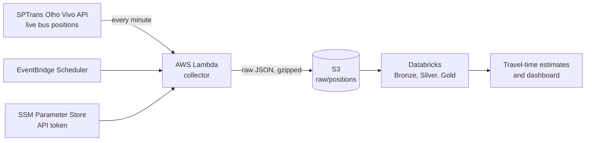

# sp-bus-eta

**How long will the bus ride between home and Parque Ibirapuera take, right now?**

Google Maps gives one number from the timetable. This project estimates the
real door-to-door time (walk, wait and ride) from the live GPS positions of
the São Paulo buses that make the trip, and says how bad a bad day gets.

> **Status:** collecting data. The collector has been running in AWS every
> minute since 2026-10-04; the Databricks pipeline and the estimates come next.

## How it works



1. **Collect.** A Lambda polls the positions of the bus lines that run
   directly between the two places, in both directions, and lands each
   response untouched in S3, partitioned by date and hour.
2. **Clean** *(next)*. Databricks turns the raw snapshots into one row per
   vehicle and minute: deduplicated, with GPS noise and stale positions removed.
3. **Measure** *(next)*. Each vehicle seen near the boarding point and later
   near the destination is one observed trip. The wait comes from the real
   headway between buses, counting every line that serves the stretch, since
   any of them will do.
4. **Estimate** *(next)*. Typical (p50) and bad-day (p90) times by direction,
   day of week and 15-minute slot, benchmarked against the arrival predictions
   SPTrans publishes itself.

## Design decisions

- **Small data on purpose.** Six lines, both directions, once a minute: about
  1.4 KB compressed per run, roughly 2 MB a day. Databricks is not needed at
  this size; it is used because the patterns (Auto Loader, Medallion layers,
  data quality checks, Asset Bundles) are the same at any scale.
- **Raw is the contract.** The collector does not parse or filter anything.
  Every cleaning rule lives downstream, so a bug there is fixed by
  reprocessing, never by re-collecting data that is gone.
- **One minute is enough.** A ride takes 20 to 40 minutes; sampling every
  minute bounds the timing error to about 30 seconds at each end, before any
  interpolation along the route. It is also the finest interval EventBridge
  Scheduler offers.
- **No retries for a missed minute.** A late snapshot would carry the wrong
  time, and the next run is a minute away. Gaps are measured downstream instead.
- **Line codes resolved at runtime.** The API identifies lines by internal
  codes that change when SPTrans updates its registry; the config only holds
  public line numbers.
- **Least privilege.** The collector can write to one S3 prefix and read one
  parameter, nothing else. The policy baseline came from running IAM Policy
  Autopilot on the handler, then narrowed to the concrete resources.
- **The token never touches the state.** It lives in an SSM SecureString
  created outside Terraform, and the IAM policy references it by name.

## Repository layout

| Path | What it is |
|---|---|
| [`collector/`](collector/) | Lambda handler and the list of bus lines to follow |
| [`infra/`](infra/) | Terraform: S3, Lambda, IAM roles, schedule |

## Running it yourself

You need an [Olho Vivo API token](https://www.sptrans.com.br/desenvolvedores/)
and an AWS account. One-time setup, outside Terraform:

```bash
# Bucket for the Terraform state (versioned, private)
aws s3api create-bucket --bucket <state-bucket> --region sa-east-1 \
  --create-bucket-configuration LocationConstraint=sa-east-1
aws s3api put-bucket-versioning --bucket <state-bucket> \
  --versioning-configuration Status=Enabled

# API token as a SecureString, read from a file so it stays out of shell history
aws ssm put-parameter --name /sp-bus-eta/sptrans-token --type SecureString \
  --value file://path/to/token.txt
```

Then point the `backend "s3"` block in [`infra/main.tf`](infra/main.tf) at your
state bucket and run `terraform init && terraform apply` from `infra/`.
Running costs stay well under US$1 a month.

## License

[MIT](LICENSE)
