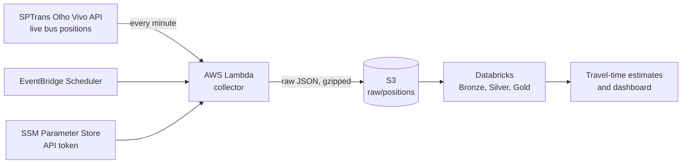

# sp-bus-eta

**How long will the bus ride between home and Parque Ibirapuera take, right now?**

Google Maps gives one number from the timetable. This project measures the
real ride time from the live GPS positions of the São Paulo buses that make
the trip, and says how bad a bad day gets. It is a deliberately simple model,
built to show a data pipeline end to end rather than to plan real trips.

> **Status:** running end to end. The collector has run in AWS every minute
> since 2026-10-04, and a daily Databricks job turns the raw files into ride
> times. First hour of data: 15 observed trips, median 17 to 19 minutes.

## How it works



1. **Collect.** A Lambda polls the positions of the bus lines that run
   directly between the two places, in both directions, and lands each
   response untouched in S3, partitioned by date and hour.
2. **Clean**. Databricks turns the raw snapshots into one row per
   vehicle and minute: deduplicated, with GPS noise and stale positions removed.
3. **Measure**. Two circular zones, one around home and one around
   the park. A bus seen in one zone and later in the other is one observed
   trip; the ride time is the gap between the two sightings. All six lines
   count as a single option, since any of them makes the trip.
4. **Estimate**. Typical (p50) and bad-day (p90) ride times by
   direction, hour of day, and weekday versus weekend.

Out of scope on purpose: walking, waiting at the stop, exact bus stops and
route shapes. Each would add precision, none would change the pipeline.

## Design decisions

- **Small data on purpose.** Six lines, both directions, once a minute: about
  1.4 KB compressed per run, roughly 2 MB a day. Databricks is not needed at
  this size; it is used because the patterns (Auto Loader, Medallion layers,
  data quality checks, Asset Bundles) are the same at any scale.
- **Raw is the contract.** The collector does not parse or filter anything.
  Every cleaning rule lives downstream, so a bug there is fixed by
  reprocessing, never by re-collecting data that is gone.
- **One minute is enough.** A ride takes 20 to 40 minutes; sampling every
  minute bounds the timing error to about 30 seconds at each end, before any
  interpolation along the route. It is also the finest interval EventBridge
  Scheduler offers.
- **No retries for a missed minute.** A late snapshot would carry the wrong
  time, and the next run is a minute away. Gaps are measured downstream instead.
- **Line codes resolved at runtime.** The API identifies lines by internal
  codes that change when SPTrans updates its registry; the config only holds
  public line numbers.
- **Least privilege.** The collector can write to one S3 prefix and read one
  parameter, nothing else. The policy baseline came from running IAM Policy
  Autopilot on the handler, then narrowed to the concrete resources.
- **Free Edition workaround.** Databricks Free Edition cannot use Unity
  Catalog external locations, so a first task mirrors new S3 files into a
  managed volume with a read-only key, and Auto Loader reads from there. The
  copy is idempotent: a rerun only fetches what is missing.
- **Personal data stays out of the code.** The home zone is a Databricks
  secret, read by the gold task at runtime; the published tables hold ride
  times, not coordinates.
- **The token never touches the state.** It lives in an SSM SecureString
  created outside Terraform, and the IAM policy references it by name.

## Repository layout

| Path | What it is |
|---|---|
| [`collector/`](collector/) | Lambda handler and the list of bus lines to follow |
| [`infra/`](infra/) | Terraform: S3, Lambda, IAM roles, schedule |
| [`pipeline/`](pipeline/) | Databricks Asset Bundle: schema, volumes and the daily job (sync, bronze, silver, gold) |
| [`scripts/`](scripts/) | Rotates the read-only AWS key Databricks uses and stores it as a Databricks secret |
| [`config/`](config/) | The park zone. The home zone stays in a git-ignored local file |

## Running it yourself

You need an [Olho Vivo API token](https://www.sptrans.com.br/desenvolvedores/)
and an AWS account. One-time setup, outside Terraform:

```bash
# Bucket for the Terraform state (versioned, private)
aws s3api create-bucket --bucket <state-bucket> --region sa-east-1 \
  --create-bucket-configuration LocationConstraint=sa-east-1
aws s3api put-bucket-versioning --bucket <state-bucket> \
  --versioning-configuration Status=Enabled

# API token as a SecureString, read from a file so it stays out of shell history
aws ssm put-parameter --name /sp-bus-eta/sptrans-token --type SecureString \
  --value file://path/to/token.txt
```

Then point the `backend "s3"` block in [`infra/main.tf`](infra/main.tf) at your
state bucket and run `terraform init && terraform apply` from `infra/`.
Running costs stay well under US$1 a month.

## License

[MIT](LICENSE)
